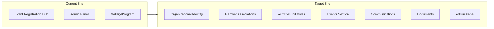

# UNMA Website Revamp Plan

## Current State vs Target State



## Site Architecture

### New Navigation Structure

- **Home** - Organizational landing (not event countdown)
- **About UNMA** - Positioning, objectives, principles
- **Membership** - Model, joining/exit process
- **Coordination Team** - Office bearers (not "governing body")
- **Member Associations** - List with disclaimer
- **Activities** - Joint initiatives
- **Events** - Upcoming, past, registration (existing functionality)
- **Communications** - Updates, invitations, summaries
- **Documents** - Registration cert, bylaws
- **Contact** - Existing + participation interest form

### Key Files to Create/Modify

**Frontend - New Pages:**

- `src/pages/AboutUnma.jsx` - Organizational identity page
- `src/pages/Membership.jsx` - Membership model page
- `src/pages/CoordinationTeam.jsx` - Team page
- `src/pages/MemberAssociations.jsx` - Associations list
- `src/pages/Activities.jsx` - Joint initiatives
- `src/pages/Events.jsx` - Events hub (links to existing)
- `src/pages/Communications.jsx` - Updates page
- `src/pages/Documents.jsx` - Transparency section

**Frontend - Modify:**

- `src/pages/Home.jsx` - Complete redesign from event-focused to organizational
- `src/components/layout/Header.jsx` - New navigation structure
- `src/components/layout/Footer.jsx` - Add mandatory disclaimer
- `src/App.jsx` - Add new routes

**Content Data:**

- `src/data/memberAssociations.js` - Association data structure
- `src/data/coordinationTeam.js` - Team members data
- `src/data/activities.js` - Activities/initiatives data
- `src/data/siteContent.js` - Centralized content strings

---

## Phase 1: Foundation

### 1.1 Content Data Structure

Create `src/data/` folder with hardcoded content following positioning rules:

```javascript
// siteContent.js - Key messaging
export const SITE_CONTENT = {
  tagline:
    "A voluntary platform for Kerala, Mahe & Lakshadweep JNV alumni associations",
  about: {
    whatWeAre: "UNMA is a trust formed by...",
    whatWeAreNot: "UNMA is NOT an apex body, NOT an umbrella organization...",
    // ...
  },
};
```

### 1.2 Navigation Update

Modify [Header.jsx](unma2025-frontend/src/components/layout/Header.jsx):

- Replace current nav with new structure
- Add dropdowns for sub-sections
- Mobile-responsive menu update

### 1.3 Footer Update

Modify Footer to include mandatory disclaimer:

> "UNMA is a trust of independent alumni bodies. Participation does not affect the autonomy of any member association."

---

## Phase 2: Core Pages

### 2.1 Home Page Redesign

Transform from event countdown to organizational landing:

**Sections:**

1. Hero - One-line description + coverage area
2. What is UNMA - Brief positioning (NOT apex body)
3. Quick Stats - Associations, districts, initiatives
4. Recent Activities - 3-4 cards
5. Upcoming Events - Link to Events section
6. Join/Participate CTA

### 2.2 About UNMA Page

**Sections:**

- Background and formation story
- Need for a common platform
- Core objectives (3-5 bullet points)
- Operating principles with emphasis on:
  - Voluntary participation
  - Equal status of all associations
  - Non-controlling nature
- Legal registration (brief mention)

### 2.3 Membership Page

**Sections:**

- Who can join (JNV alumni associations)
- Representation model (President + Secretary by convention)
- Voluntary participation statement
- Joining process
- Exit process
- Independence disclaimer

### 2.4 Coordination Team Page

**Sections:**

- Purpose statement (coordination only, not governance)
- Current team with roles:
  - President/Coordinator
  - Secretary
  - Treasurer
  - Committee members
- Selection method explanation
- Explicit role limitation statement

### 2.5 Member Associations Page

**Sections:**

- Introduction with disclaimer
- List/grid of associations:
  - Name
  - District/Region
  - Year joined
  - Status (Active/Observer)
- Footer disclaimer: "Listing does not imply hierarchy"

---

## Phase 3: Secondary Pages

### 3.1 Activities Page

**Sections:**

- Introduction to collaborative initiatives
- Activity categories:
  - Joint alumni meets
  - Student welfare
  - Health awareness
  - Career guidance
  - Knowledge sharing
- Activity cards with:
  - Participating associations
  - Purpose
  - Outcome

### 3.2 Events Hub Page

**Sections:**

- Upcoming events
- Past events
- Link to existing event registration (Republic Day Event, etc.)
- Gallery integration

### 3.3 Communications Page

**Sections:**

- Latest updates
- Invitations
- Meeting summaries
- Proposals
- Language: Collaborative tone (not directive)

### 3.4 Documents Page

**Sections:**

- Registration certificate (PDF link)
- Basic bylaws (PDF link)
- Annual summaries
- Disclaimer: "Informational, not regulatory"

---

## Phase 4: Integration

### 4.1 Route Configuration

Update [App.jsx](unma2025-frontend/src/App.jsx):

```javascript
// New public routes
<Route path="/about" element={<AboutUnma />} />
<Route path="/membership" element={<Membership />} />
<Route path="/team" element={<CoordinationTeam />} />
<Route path="/associations" element={<MemberAssociations />} />
<Route path="/activities" element={<Activities />} />
<Route path="/events" element={<Events />} />
<Route path="/communications" element={<Communications />} />
<Route path="/documents" element={<Documents />} />
```

### 4.2 Existing Event Pages

Move under Events umbrella:

- `/events/republic-day-2025` - Republic Day Event
- `/events/gallery` - Event galleries
- `/events/program` - Event programs

### 4.3 SEO and Meta

Add appropriate meta tags and page titles reflecting organizational identity.

---

## Positioning Rules Checklist

Every page must be reviewed against:

| Rule | Implementation |

| ----------------------- | --------------------------------------------- |

| Never say "apex body" | Use "platform", "coordination" |

| Never imply hierarchy | Equal listing, disclaimers |

| Never suggest control | "Facilitates", not "directs" |

| Emphasize voluntary | Explicit statements on each relevant page |

| Independence of members | Disclaimers in Membership, Associations pages |

---

## File Structure After Revamp

```
src/
├── data/
│   ├── siteContent.js        # Centralized text content
│   ├── memberAssociations.js # Associations data
│   ├── coordinationTeam.js   # Team data
│   └── activities.js         # Activities data
├── pages/
│   ├── Home.jsx              # Redesigned
│   ├── AboutUnma.jsx         # New
│   ├── Membership.jsx        # New
│   ├── CoordinationTeam.jsx  # New
│   ├── MemberAssociations.jsx # New
│   ├── Activities.jsx        # New
│   ├── Events.jsx            # New hub
│   ├── Communications.jsx    # New
│   ├── Documents.jsx         # New
│   └── Contact.jsx           # Enhanced
└── components/
    └── layout/
        ├── Header.jsx        # Updated nav
        └── Footer.jsx        # Added disclaimer
```

---

## Content Placeholders

For partial member data, create structure:

```javascript
// memberAssociations.js
export const MEMBER_ASSOCIATIONS = [
  {
    id: 1,
    name: "JNV Alumni Association, Thiruvananthapuram",
    district: "Thiruvananthapuram",
    region: "Kerala",
    yearJoined: 2020,
    status: "active",
  },
  // Add more as data becomes available
];
```

---

## Testing Considerations

- Content review for positioning compliance
- Mobile responsiveness for all new pages
- Navigation flow verification
- Footer disclaimer visibility
- Event registration functionality preserved
